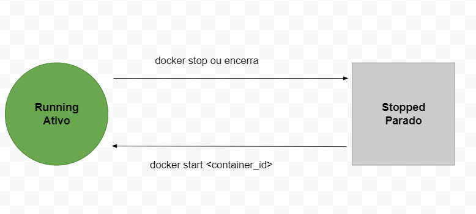
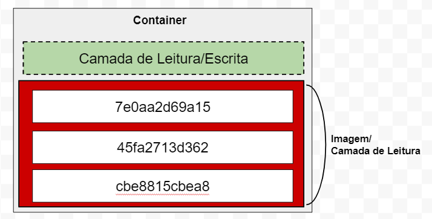

# Estados de um Container
Um container pode estar no estado **running(ativo)** ou **stopped(parado)**.

Ao criamos(run) ou ativarmos(start) o container fica no estado de running,  e quando paramos(stop) ou encerra fica no estado stopped.

# Layered File System(Sistema de arquivos em camadas)

Uma imagem é composta de uma ou mais camadas, que podem ser reaproveitadas em outras imagens, dai vem o nome de Layered File System, ou seja sistema de arquivos em camadas. Essas camadas da iamgem são apenas de leitura(read only) e no momento em que um container é construido uma nova camada fina de leira e escrita é criada em cima da imagem para possibilitar a inserção ou remoção de arquivos dentro do container, portanto com uma imgem base conseguimos criar varios container para diversas finalidades. 

[Fonte conteudo](https://docs.docker.com/storage/storagedriver)