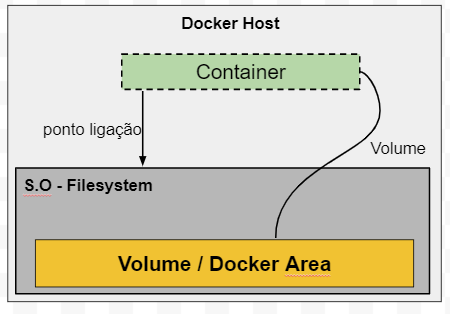

# Volumes em containers

O container contem uma camada de leitura e escrita e quando removemos o container essa camada é removida junto, pois essa é a **natureza de um container ser volatil**, assim podemos construir e destruir container de modor rapido e facil.


E meu banco de dados/código ou Log, como faço para manter os dados e ainda assim trabalhar com container?

A solução é usar volume, um volume é basicamente um **espaço(diretório) criado no Docker Host** e apontamos esse volume para que o container criado possa usar e salvar os dados, assim quando destruir o container os dados continuaram a existir no volume.


 

Usamo a opção **-v** para indicar que iremo usar um volume

```
 docker run -it -v "C:\Users\Dunha\volume_docker\data:/home/data" ubuntu
 
 docker run -p 8080:3000 -v "C:\Users\Dunha\Projetos\volume-exemplo:/var/www" -w "/var/www" node npm start
```

Faça uma inspeção no container e procure pela opção Mounts, veja o *'Source'* é o diretório no Host e *'Destination'* é diretório de referência dentro do container

```
docker inspect <container_ID>

 "Mounts": [
            {
                "Type": "bind",
                "Source": "C:\\Users\\Dunha\\volume_docker\\data",
                "Destination": "/home/data",
```