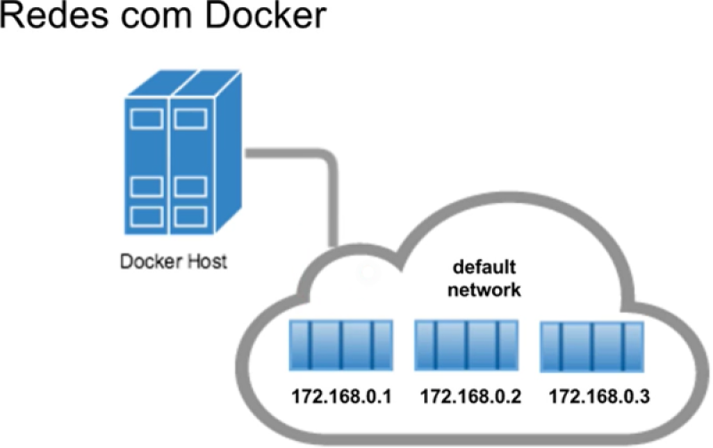
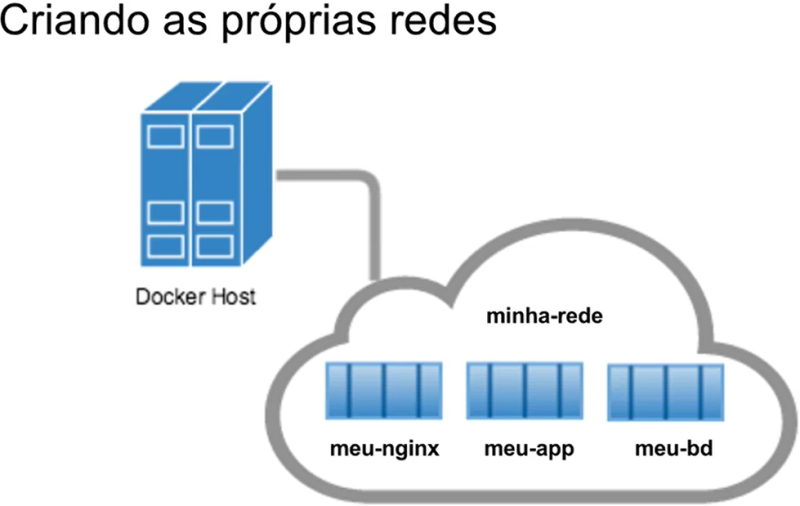

# Conectando Múltiplos Container

Geralmente separarmos as partes que compõem aplicação(proxy, app, BD) em um **container específico**, para cada container ficar com somente uma **única responsabilidade**.

Por padrão do Docker tem uma **Default network**, significa que quando criamos os nossos container, todos já estão rodando na **mesma rede e podem se comunicar** através de seus respectivos IPs que são **automaticamente atribuídos**. Logo, se **não sabemos qual o IP que será atribuído** ao container, **não é muito útil** para nós quando queremos **fazer a comunicação entre** os mesmos.

 

A rede padrão do Docker só conseguimos fazer comunicação por IPs, **não é possivel atribuir um hostname a um container**, para resolver esse problema devemos criar a nossa network, e dar os "alias" aos nossos container para realizarem a comunicação entre eles utilizando seus nomes:

 


# Criar própria network

Para termos os containers compartilhando na rede, devemos utilizar o *driver* de *bridge*

```shell
 docker network create --driver bridge <nome-da-rede>

 docker network create --driver bridge minha-rede
```

Criar containers atrelado à rede que acabamos de criar, através da flag --network e apartir dai podemos utilizar o nome(*--name*) do container como se fosse o *hostname* para comunicar entre os container.

```shell
 docker run -d -p 5432:5432 --name srv_pg -e POSTGRES_PASSWORD="postgres" -e POSTGRES_DB="test" --network minha-rede postgres:alpine
 
 docker inspect srv_pg
 "Networks": {"minha-rede": {
```


